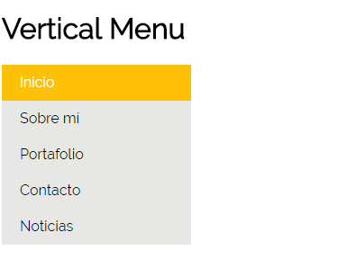

### Menú vertical

## Objetivo

El objetivo de esta pagina es crear un vertical menu, esto lo haremos con la propiedad display.

## Herramientas Utilizadas

- html , para la estructura del contenido.
- css , para darle estilo al contenido.

## Archivos

- index.html = contiene la estructura del menú.
- main.css = contiene el estilo que se aplicará a la estructura HTML.

## Html

- estructura básica
- enlace con: archivo de estilo css (main.css)
- enlace con: archivo de funcionalidad javascript (app.js) el cual se puede implementar a solicitud.

## Css

- uso de nav: utilizamos la etiqueta nav para indicar al navegador que estamos haciendo un menú.

- uso de ul: al usarz la etiqueta ul estaremos creando una lista desordenada, que contendra a varios li.

- uso de li: dentro de li(padres), contendremos a las etiquetas "a".

- uso de a: utilizamos la etiqueta a para linkear.

- uso de pseudoclases: usaremos dos pseudoclases hover y active, la primera nos serviran para cambiar el color del backgraund cuando pasa el cursor y la segunda para cambiar el color del backgraund cuando hacemos click.

## Imagen
